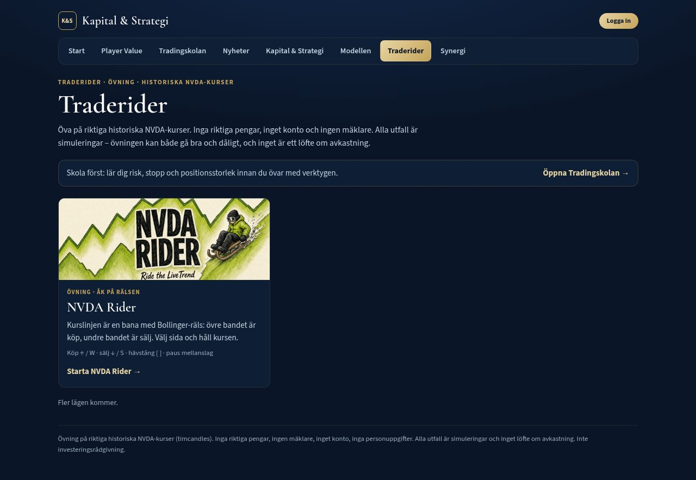
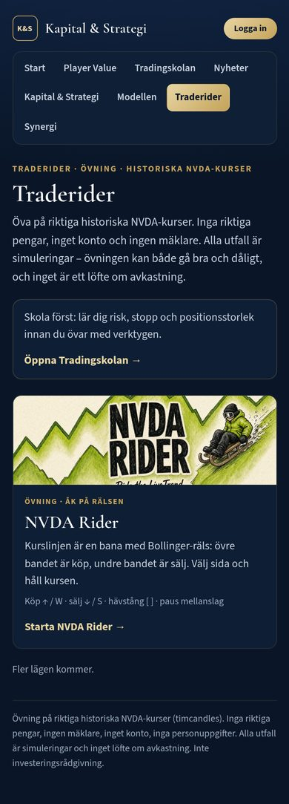
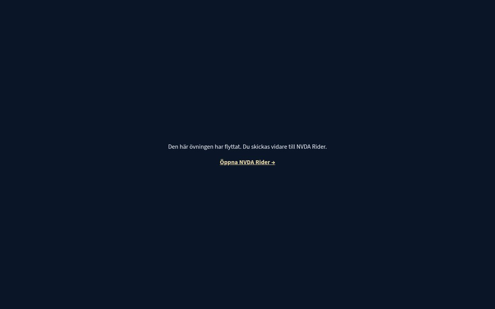
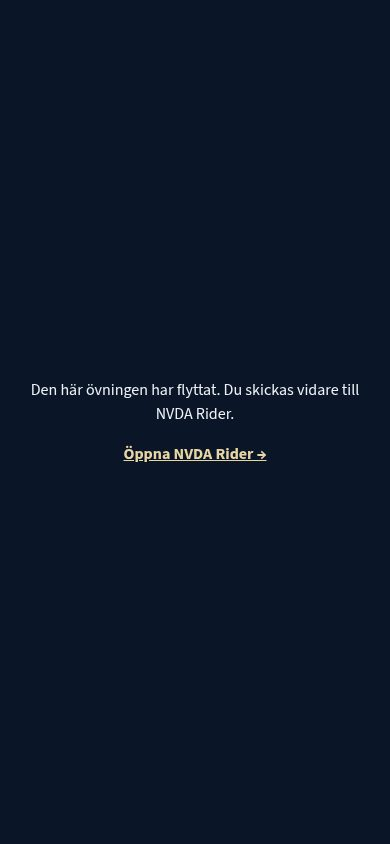
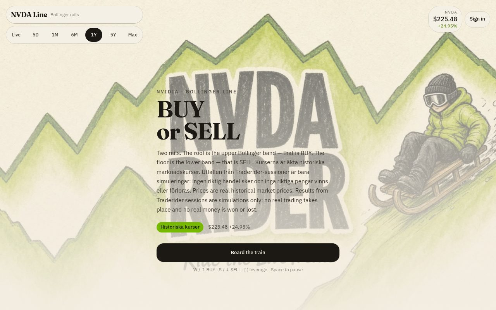
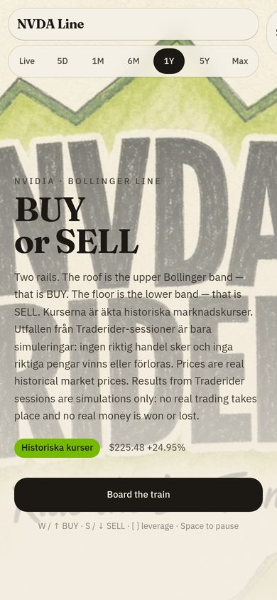

# Demosidor pekar till NVDA Rider (spärrad variant)

Ägaren har spärrat demoramen under `/traderider/demo/` (pixeltåget med konduktörsporträtt, 20-SMA-mittfilen med Övre och Undre, «Övningskapital (sim.) $100,000», Köp/Sälj/Platt, «Paus · mellanslag», «Alla lägen»). Tills vidare:

- `/traderider/demo/`, `/traderider/demo/tag/`, `/traderider/demo/raket/` och `/traderider/demo/akademin/` är enkla omdirigeringar till `/nvda-rider/` (meta refresh + `location.replace` + synlig länk).
- Ingångssidan `/traderider/` leder bara till NVDA Rider, med raden «Fler lägen kommer.»
- Källkoden (`traderider/app/src/demo/` m.fl.) och de byggda bundlarna i `traderider/demo/assets/` ligger kvar i repot men laddas inte av någon sida.
- `npm run build:demo` skriver tillbaka omdirigeringen efter bygget, och `scripts/check-demo.mjs` fallerar om någon ingång inte är omdirigeringen.

Verifiering (lokal statisk server som efterliknar GitHub Pages, Playwright, dator 1280×800 och mobil 390×844): se `verifiering.json`.

| Dator | Mobil |
| --- | --- |
|  |  |
|  |  |
|  |  |
