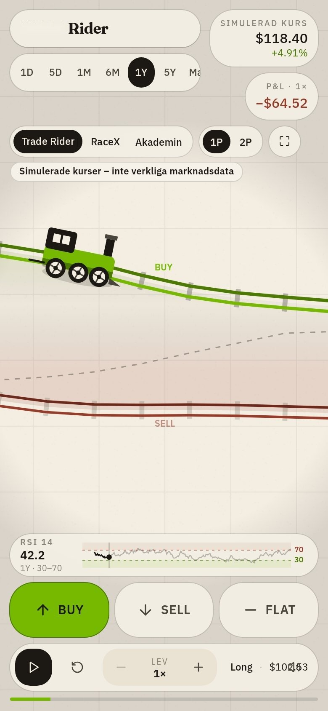

# Traderider (utkast)

Fyra övningslägen på samma sida, `/traderider/spel/`. Kurserna i övningen är märkta simulerade. Inga riktiga pengar och ingen inloggning.

| Adress | Vad |
| --- | --- |
| `/traderider/` | Ingången med fyra kort. |
| `/traderider/spel/#trade-rider` | Trade Rider. Växeln högst upp byter läge. Äldre adressen `#nvda-rider` öppnar samma läge. |
| `/traderider/spel/#racex` | RaceX. Äldre adressen `#raket` öppnar samma läge. |
| `/traderider/spel/#academy` | Akademin: fyra lektioner med utmärkelser, och kapitlet Hansan – köpmännens riskskola. Äldre adressen `#akademin` öppnar samma läge. |
| `/traderider/spel/#rabbit-hole` | Rabbit Hole. |

Etiketten «Simulerade kurser – inte verkliga marknadsdata» syns i övningen och på `/traderider/`.

## Koppling

Hur lägena hänger ihop med Tradingskolan, vad spelaren övar, och vilken lektion som ligger närmast, står i [koppling.md](koppling.md). Skolavsnitt och quiz är rekommenderade, inte ett krav, och ger ingen licens att handla.

## Skärmdumpar

| Dator | Mobil |
| --- | --- |
|  |  |
|  |  |
|  |  |
|  |  |
|  |  |
