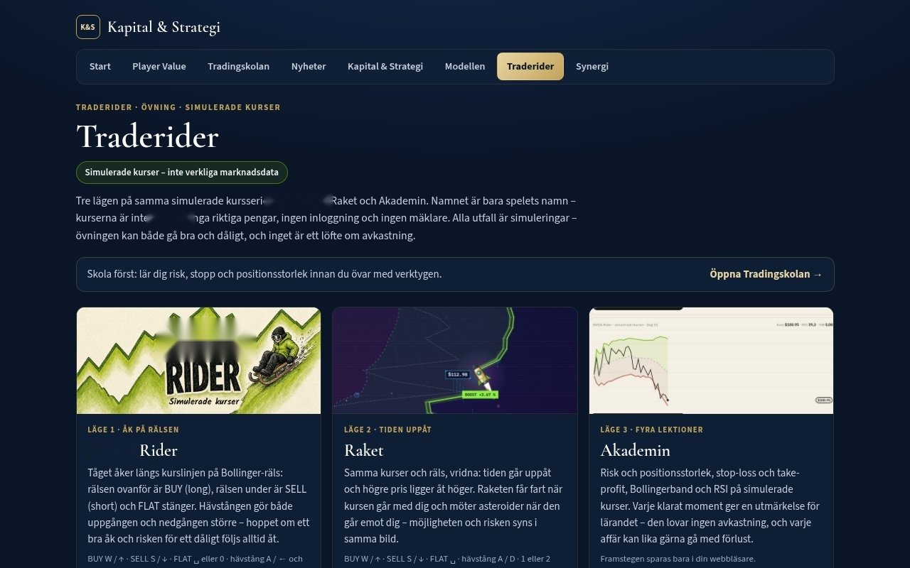
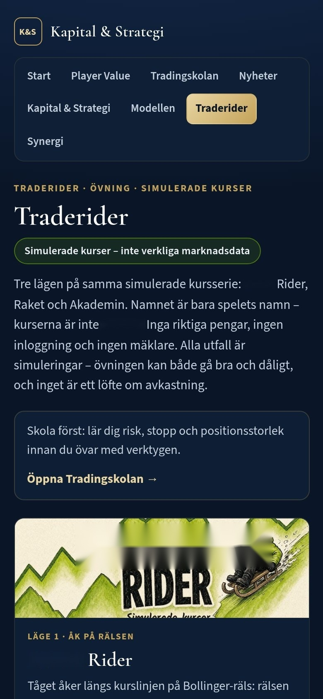
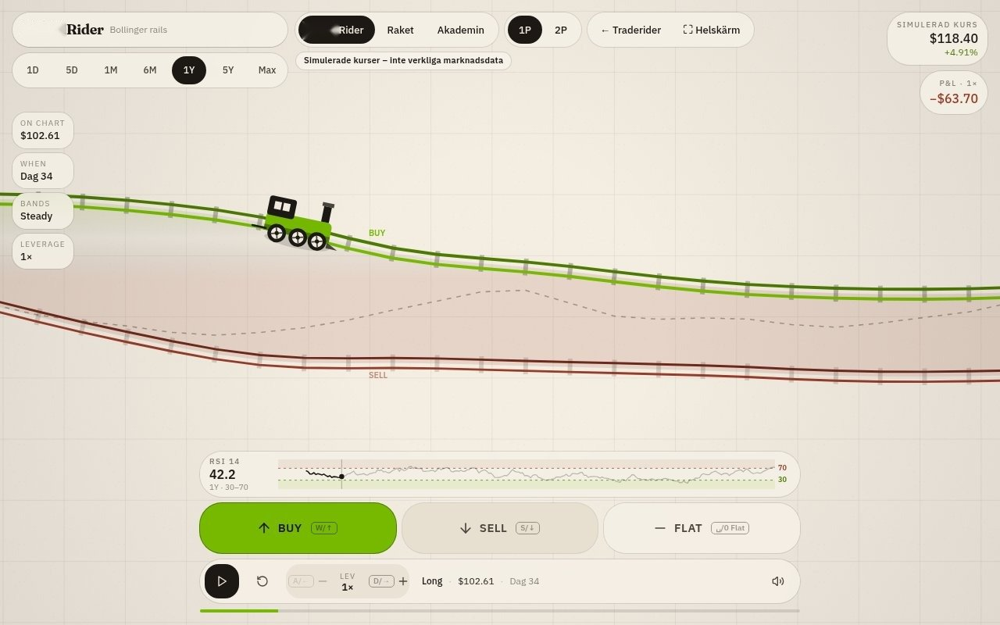
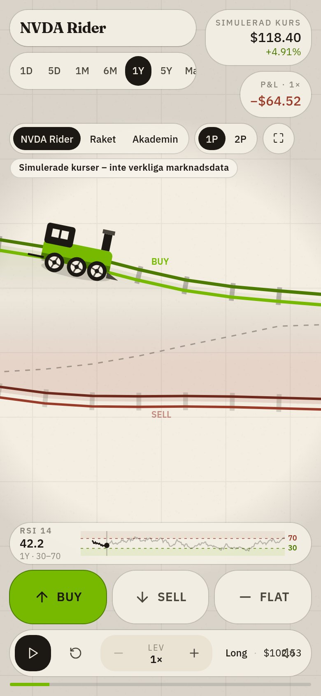
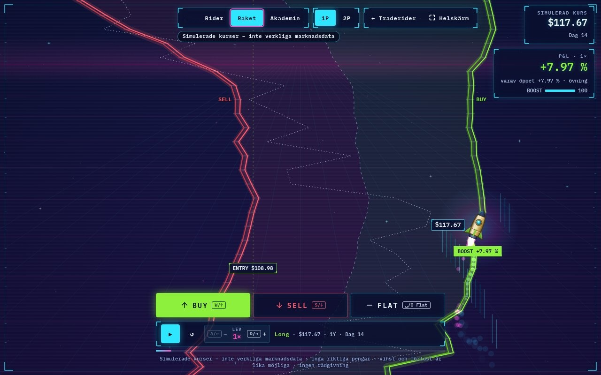
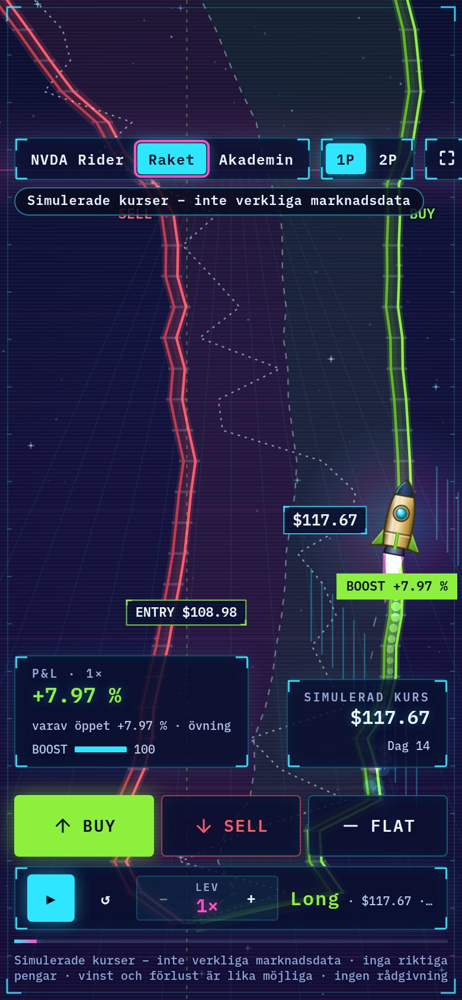
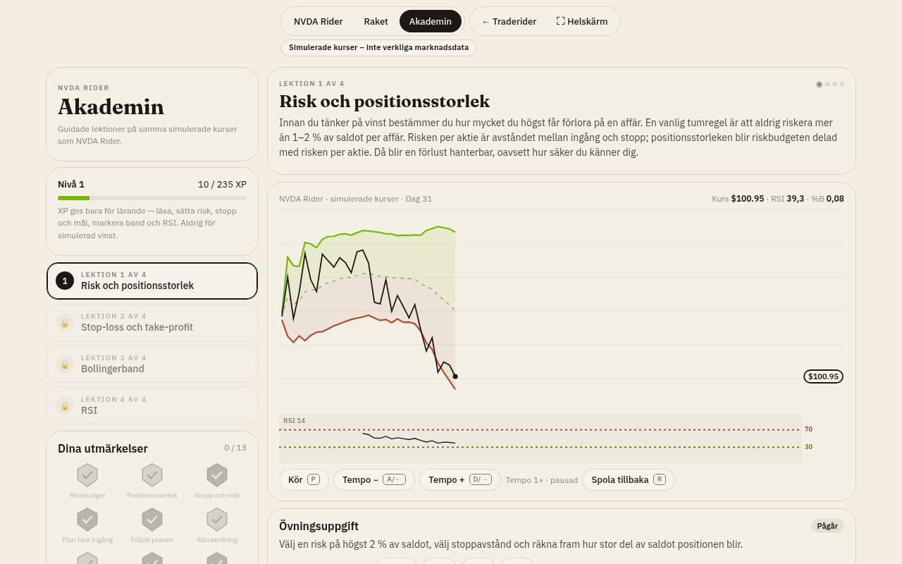
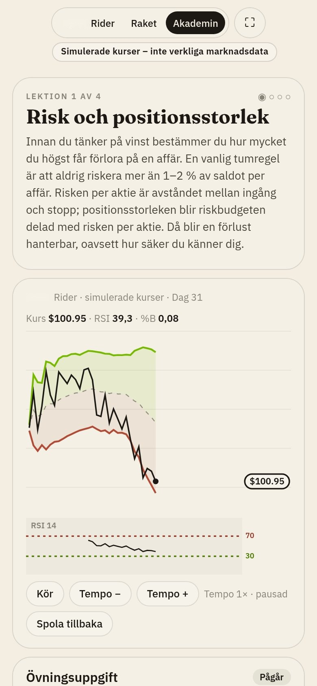
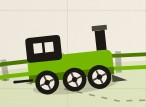

# Traderider (utkast)

Tre övningslägen på samma sida, `/traderider/spel/`. Kurserna i övningen är märkta simulerade. Inga riktiga pengar och ingen inloggning.

| Adress | Vad |
| --- | --- |
| `/traderider/` | Ingången med tre kort. |
| `/traderider/spel/#nvda-rider` | Första läget. Växeln högst upp byter läge. |
| `/traderider/spel/#raket` | Raket. |
| `/traderider/spel/#akademin` | Akademin: fyra lektioner med utmärkelser. |

Etiketten «Simulerade kurser – inte verkliga marknadsdata» syns i övningen och på `/traderider/`.

## Koppling

Hur lägena hänger ihop med Tradingskolan, vad spelaren övar, och vilken lektion som ligger närmast, står i [koppling.md](koppling.md). Skolan först är en rekommendation, inte ett krav.

## Skärmdumpar

| Dator | Mobil |
| --- | --- |
|  |  |
|  |  |
|  |  |
|  |  |
|  |  |
